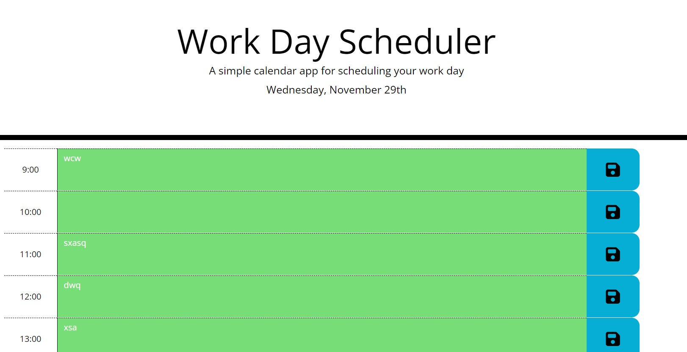

# Daily Planner App

## Description
This project mainly uses JQuery alongside HTML and CSS to present the user with a daily planner they can utilize. The planner presents the user with slots of the working hours and the user can put in notes into these slots which are then stored in the local storage. The slots are colour coded: Green for the future, red for the current hour and white for past hour slots.

Please view the 'Credits' section below for the sources I used to implement my ideas. The US and AC below are directly taken from the Skills for Life challenge 7 (FE Bootcamp)

## User Story
AS AN employee with a busy schedule
I WANT to add important events to a daily planner
SO THAT I can manage my time effectively

## Acceptance Criteria
The app should:

Display the current day at the top of the calendar when a user opens the planner.

Present timeblocks for standard business hours when the user scrolls down.

Color-code each timeblock based on past, present, and future when the timeblock is viewed.

Allow a user to enter an event when they click a timeblock.

Save the event in local storage when the save button is clicked in that timeblock.

Persist events between refreshes of a page.

## Link to published site
https://09hanvaik.github.io/DailyPlannerApp/

## Screenshot of site

## Installation

No installation steps required.

## Credits
* https://api.jquery.com/
* https://www.freecodecamp.org/news/format-dates-with-ordinal-number-suffixes-javascript/#:~:text=In%20this%20short%20article%2C%20you,%E2%80%9D%20(like%20for%204th).
* https://www.w3schools.com/jsref/jsref_slice_string.asp